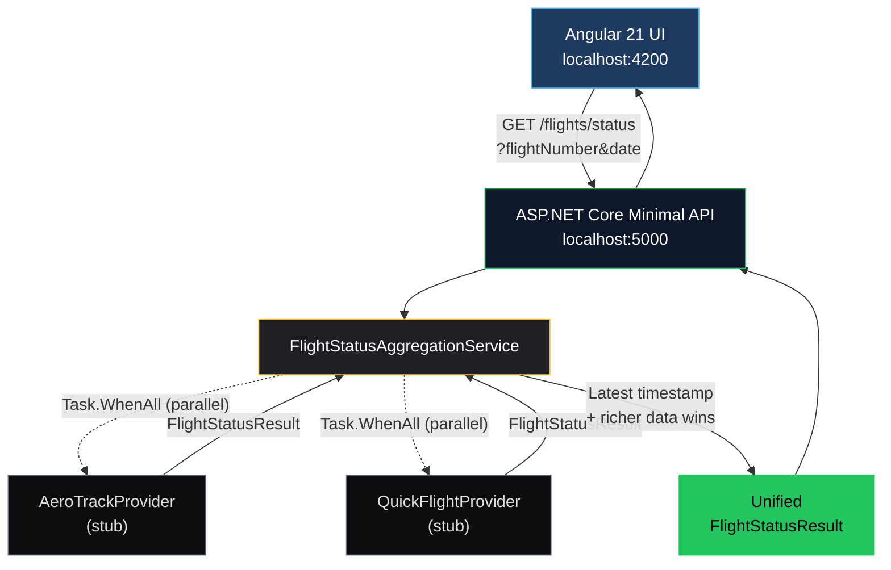

# SkyRoute Flight Status Aggregator

## Overview

SkyRoute Flight Status is a flight status aggregation system that queries multiple upstream providers in parallel, normalizes their responses, and returns the most recently updated result. It demonstrates Clean Architecture, provider abstraction, fault tolerance, and AI-assisted development using GitHub Copilot.

## Architecture



**Key design decisions:**

- **Provider Pattern** — Each provider implements `IFlightStatusProvider`, enabling new sources to be added without modifying aggregation logic (Open/Closed Principle).
- **Parallel Execution** — Providers are queried concurrently via `Task.WhenAll` for minimum latency.
- **Deterministic Selection Rules** — When multiple providers return data, selection follows:
  1. Most recent `LastUpdatedUtc` wins.
  2. On timestamp tie, the result with more populated detail fields (Gate, Terminal, DelayReason, Message) wins — "richer data wins".
  3. On both ties, alphabetical provider name wins for full determinism.
- **Fault Tolerance** — Individual provider failures are caught and logged; the aggregator continues with remaining results.
- **Unknown Fallback** — If no provider returns data (or all fail), a deterministic `Unknown` status is returned (never null).

## API Contract

```
GET /flights/status?flightNumber={flightNumber}&date={yyyy-MM-dd}
```

**Parameters:**

| Parameter | Type | Required | Example |
|---|---|---|---|
| `flightNumber` | string | Yes | AI101 |
| `date` | string (ISO date) | Yes | 2026-06-14 |

**Success Response (200):**

```json
{
  "flightNumber": "AI101",
  "flightDate": "2026-06-14",
  "status": 2,
  "lastUpdatedUtc": "2026-06-14T09:55:00Z",
  "providerName": "QuickFlight",
  "gate": "A12",
  "terminal": "T1",
  "delayReason": "Weather",
  "message": "Flight delayed due to adverse weather conditions"
}
```

**Status Enum:**

| Value | Meaning |
|---|---|
| 0 | Unknown |
| 1 | OnTime |
| 2 | Delayed |
| 3 | Cancelled |
| 4 | Diverted |

**Error Response (400):** Returned when `flightNumber` or `date` is missing or invalid.

## Sample Flight Numbers

| Flight | Expected Status | Winning Provider | Gate | Terminal | Delay Reason |
|---|---|---|---|---|---|
| AI101 | Delayed | QuickFlight | A12 | T1 | Weather |
| AI202 | OnTime | AeroTrack | — | — | — |
| BA303 | Cancelled | QuickFlight | — | — | — |
| AI404 | Diverted | AeroTrack | — | — | — |
| XYZ999 | Unknown | None | — | — | — |

## Project Structure

```
├── src/
│   ├── FlightStatus.Api/              # Minimal API, DI, CORS, Swagger
│   ├── FlightStatus.Application/      # Aggregation service, interfaces
│   ├── FlightStatus.Domain/           # FlightStatusResult, FlightStatus enum
│   └── FlightStatus.Infrastructure/   # AeroTrack, QuickFlight providers
├── tests/
│   └── FlightStatus.Tests/            # xUnit tests (aggregation, mapping, failures)
├── flight-status-ui/                  # Angular 21 standalone frontend
├── spec.md                            # Original assignment specification
├── prompts.md                         # AI prompt log with governance trail
└── reflection.md                      # AI hallucinations and lessons learned
```

## How To Run

### Backend

```bash
dotnet run --project src/FlightStatus.Api
```

API starts at `http://localhost:5000`. Swagger UI available at `/swagger`.

### Frontend

```bash
cd flight-status-ui
npm install
ng serve
```

Open `http://localhost:4200`. The UI calls the backend API on port 5000.

### Tests

```bash
dotnet test
```

Runs xUnit tests covering: latest-timestamp selection, tie-breaker rules (richer data + alphabetical), unknown fallback, both-providers-fail resilience, single-provider-failure resilience, invalid input handling, and per-provider status mapping (data-driven via `[Theory]`).

## Assumptions

The following business rules were defined explicitly during implementation:

- Providers return time-stamped results; the most recent `LastUpdatedUtc` is authoritative.
- When two providers report **identical timestamps**, the result with more populated detail fields (Gate, Terminal, DelayReason, Message) wins — "richer data wins" tie-breaker.
- When timestamps **and** detail-field counts are identical, alphabetical provider name (ordinal comparison) wins for full determinism.
- Provider failures (exceptions, timeouts) are logged but do not fail the request — aggregation continues with remaining providers.
- When **all** providers fail or return null, the API returns a `FlightStatusResult` with status `Unknown` and a user-friendly message (never null, never 500).
- Invalid input (null/empty `flightNumber`) returns `Unknown` rather than throwing.

## AI Tooling

- **GitHub Copilot Agent Mode** — Scaffolding, provider generation, test generation.
- **GitHub Copilot Chat** — Architecture decisions, debugging, documentation.
- See `prompts.md` for the full prompt-by-prompt log and `reflection.md` for hallucinations encountered.

### AI Governance & Validation

All AI-generated output was validated through a layered approach before being committed:

1. **Manual code review** — Every generated file was read, understood, and modified where needed.
2. **Build verification** — `dotnet build` and `ng build` confirmed compilation cleanliness.
3. **Unit testing** — xUnit tests validate aggregation logic, tie-breaker rules, failure paths, and provider mapping.
4. **Swagger testing** — API endpoints verified directly through Swagger UI before frontend integration.
5. **Frontend smoke testing** — All five sample flight scenarios exercised through the Angular UI.
6. **Hallucination logging** — Where Copilot output was incorrect, the issue, impact, and resolution are documented in `reflection.md`.

## Production Considerations

If this were a production system, the following would be added:

- **Caching** — Redis cache layer to reduce provider call frequency.
- **Resilience** — Polly retry/circuit-breaker policies on provider HTTP calls.
- **Observability** — OpenTelemetry tracing and structured logging.
- **Health Checks** — `/health` endpoint for orchestrator liveness probes.
- **CI/CD** — GitHub Actions pipeline for build, test, and deployment.